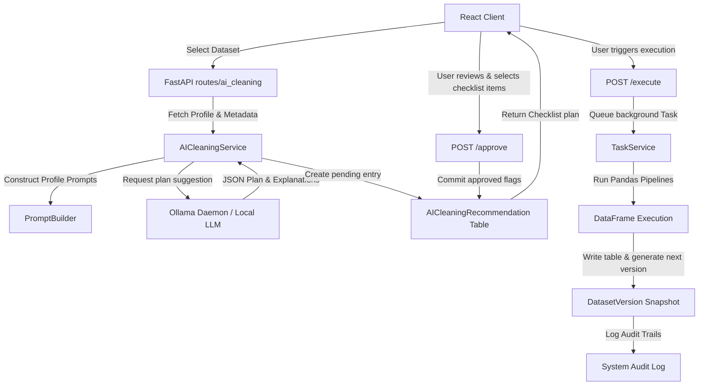

# Enterprise AI Data Cleaning & Transformation Assistant Documentation

This guide describes the workflow, approval process, transformation libraries, confidence score calibration, rollback capabilities, and limitations of the platform's Enterprise AI Data Cleaning and Transformation Assistant.

---

## ⚙️ AI Data Cleaning Workflow

The Assistant is built on a human-in-the-loop, zero-auto-execute model:

---

## 📋 User Approval & Review Process

No operations are executed automatically. The approval workflow enforces database safety:
1. **Pending Analysis**: Once a dataset is selected, local LLMs evaluate column structures and formatting types. A list of recommendations is staged in the database as `pending`.
2. **Review Checklist**: The user checks or unchecks specific recommendations based on business goals.
3. **Save Selections**: Clicking approve commits the selected step ID numbers as `approved` inside the database.
4. **Queue & Execute**: Execute runs the transformations inside Celery or local daemon threads, updates progress meters, and creates a next dataset version snapshot.

---

## 🪄 Supported Transformations

### 1. Missing Values
- **Mean / Median / Mode**: Fills empty fields with column statistics (numeric columns only).
- **ffill / bfill**: Propagates last valid observation forward or backward.
- **Drop Rows**: Removes rows containing missing values in the column.
- **Drop Columns**: Drops the column completely.

### 2. Duplicates
- **Remove Duplicate Rows**: Drops identical row duplicates.
- **Remove Duplicate Columns**: Drops identical columns.

### 3. Numeric Outliers
- **Cap IQR**: Winsorizes outlier fields within Interquartile Range boundaries.
- **Remove Rows IQR**: Drops rows falling outside IQR boundaries.

### 4. Whitespaces & casing
- **Trim Spaces**: Cleans text columns of leading and trailing spaces.
- **Casing Conversion**: `UPPERCASE`, `lowercase`, or `Title Case`.

### 5. Encoding & Scaling
- **Categorical Encoders**: Label Encoding, One-Hot Encoding, or Frequency mapping.
- **Scalers**: StandardScaler, MinMaxScaler, RobustScaler.

### 6. Formatting & Feature Engineering
- **Formatting**: Date formats (`YYYY-MM-DD`), phone number digits extract, and email syntax filtering.
- **Feature Extraction**: Extract year/month/day from dates, calculate age, segment numeric quantiles.

---

## 🛡️ Rollback Behavior

Each execution of the AI cleaning plan initiates version snapshots:
- Copies the cleaned Pandas DataFrame back into the database as a new version table (e.g. `dataset_<id>_v2`).
- Saves the file snapshot on disk.
- If a user triggers a rollback, the active table pointer switches back to the chosen historical version snapshot immediately.

---

## ⚠️ Known Limitations

1. **Quantized Local Model Performance**: Small local models (like `llama3` or `phi3` 3B/8B parameters) might occasionally output invalid JSON. A fallback mechanism is registered to build a default safe checklist plan.
2. **One-Hot Encoding Dimensions**: One-hot encoding high-cardinality categorical columns (more than 50 distinct values) could significantly expand columns and memory size.
3. **Invalid Phone/Email Strategy**: Nullifying malformed emails/phones drops them from statistics. If you need placeholder indicators, choose text casing norm mappings first.
