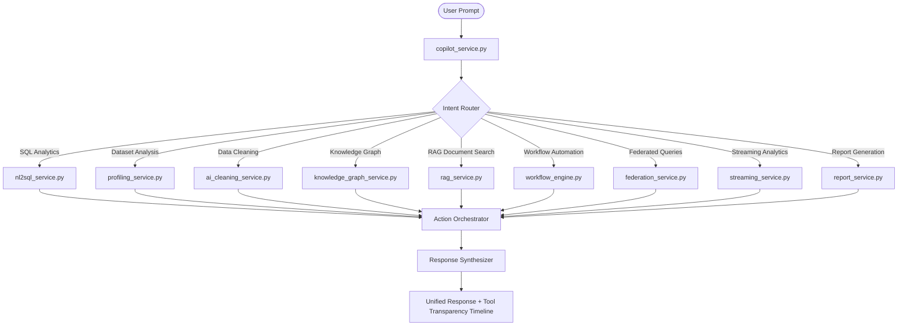

# Enterprise AI Copilot - System Architecture

This document describes the design, data structures, and implementation specifications of the unified Enterprise AI Copilot.

## System Overview

The Enterprise AI Copilot is the unified conversational interface for the entire analytics platform. It accepts natural language requests, detects user intents, dynamically plans and sequences tasks across backend engines, aggregates metrics, and returns responses with complete transparency.

---

## 1. Intent Router (Dual Classification)

To ensure high accuracy, reliability, and sub-second execution offline, the Intent Router uses a dual-engine architecture:

1. **Rule-Based Heuristic Parser**: Standard regex pattern matches looking for domain-specific keywords.
2. **Local LLM Classifier**: Invokes the offline Ollama inference endpoint with prompt instructions to output structured JSON intents.

If the local LLM encounters a network delay or timeout, the heuristic results act as a zero-latency fallback.

---

## 2. Conversation Memory & Session Lifecycle

- **Session Context**: Local transient settings (like visual selections or connection pins) are kept in active frontend memory states.
- **Database History Log**: Conversation threads (`copilot_conversations`) and individual message logs (`copilot_messages`) are persisted in the SQLite/PostgreSQL schema.
- **Privacy Controls**: No Personal Identifiable Information (PII) is exported outside the sandboxed platform rules.

---

## 3. Tool Transparency & Audits

Every orchestrator run generates a detailed `tool_transparency` payload returned with the answer:
- **Selected Modules**: Array of backend engines triggered.
- **Execution Order**: Visual layout sequence.
- **Processing Time**: Exact execution duration per step in milliseconds.
- **Confidence Rating**: Joint metric derived from intent scoring and workflow completions.
- **Limitations**: Detailed warnings or bounds encountered during runs.

---

## 4. Current Limitations

- **Local LLM Throughput**: Response latency is bounded by the host machine's hardware capability during Ollama runs.
- **Cleaning recommendations**: Auto-clean steps apply general standardizations (duplicates, date normalization); complex transformations require human checklist verification.
