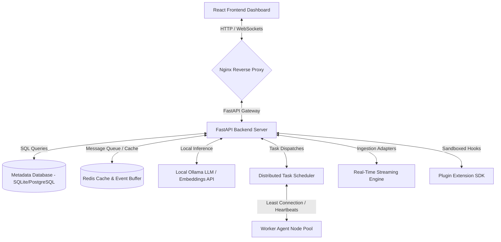

# System Architecture Overview - Version 5.0

This document describes the high-level system architecture, design patterns, and internal components layout of the AI Data Analyst Enterprise Platform (Version 5.0).

---

## 🌐 Overall Topology

The platform follows a decoupled, service-oriented structure designed to run completely offline on a single machine or distributed across containerized nodes:

---

## 🛠️ Core Subsystems

### 1. Unified Authentication & RBAC (Security Layer)
- **Token Manager**: Coordinates JWT issuance, sliding expiration updates, and cryptographically secure signature checks.
- **Limiter & Lockout**: Implements token bucket rate limiting and account lockout locks.
- **RBAC Guard**: Directs access controls validating user permissions (`view`, `user_management`) dynamically.

### 2. Multi-Agent Collaborative Analytics Workspace
- **Agent Manager**: Orchestrates planning, memory sharing, and critic loops.
- **Specialist Node Pool**:
  - `PlannerAgent`: Decomposes user questions into sub-task layouts.
  - `SQLAgent`: Formulates dialect-aware SELECT queries.
  - `RAGAgent`: Looks up corporate manuals and glossaries.
  - `VisualizationAgent`: Recommends optimal chart formats.
  - `CriticAgent`: Validates outputs and resolves inconsistencies.

### 3. Visual Workflows Engine & Recurrence Scheduler
- **DAG Execution Engine**: Traverses task pipelines topologically, executing nodes in parallel with configurable retry, delay, and failure branches.
- **Ticking Daemon**: A background scheduler checking cron intervals to execute recurring pipelines offline.

### 4. Real-Time Streaming Analytics & Ingestion
- **Queue Event Buffer**: Consumes event stream feeds using 5 tailer adapters (CSV, JSONL, Push REST, WebSockets, Directory watcher).
- **Time Windows Engine**: Calculates tumbling, sliding, and session aggregate metrics (Count, Sum, Outlier z-score).

### 5. Distributed Task Scheduler & Cluster Manager
- **Heartbeat Registry**: Keeps track of worker nodes, resources utilization stats (CPU, RAM), and active job loads.
- **Least Connection Dispatcher**: Allocates jobs to the worker with the matching capabilities and lowest workload. Handles failovers and automatically falls back to local thread context on node drops.

### 6. Sandbox Plugin Extension SDK
- **Base Interfaces**: Exposes abstract hooks for Data Sources, Custom Workflows, and Analytical tools.
- **Topological Sort Loader**: Resolves dependencies, verifies integrity schemas, and executes dynamic code safely under strict timeout bounds.

---

## 💾 Data & Persistence Models

The platform uses SQLAlchemy to map metadata entities to the target SQLite or PostgreSQL schemas:
1. `UserDataset` & `DatasetVersion`: Tracks dataset binaries versions, preview statistics, and quality profiling scorecards.
2. `DatabaseConnection`: Stores encrypted credentials and schemas mappings.
3. `Workflow` & `WorkflowExecution`: Manages visual pipelines nodes and executed run logs.
4. `KnowledgeEntity` & `KnowledgeRelationship`: Maps discovery lineages and semantic synonyms.
5. `ClusterJob`: Tracks distributed task progress, status flags, and node routing parameters.
