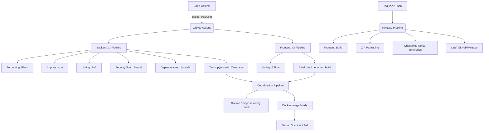

# DevOps, DevSecOps & CI/CD Pipelines Documentation

This document explains the enterprise CI/CD architecture, code quality gates, automated security checks, release cycles, and local verification procedures.

---

## 🚀 CI/CD Architecture Summary

We automate code verification and release workflows using GitHub Actions. The pipelines run on push, pull requests, and tag creation events.



---

## 🔒 Automated Quality Gates & Security Scans

### 1. Python Code Verification (Backend)
- **Formatting Checks (Black)**: Verifies that code meets style rules (line length of 120, standard formatting constraints).
- **Import Sorting (isort)**: Verifies that Python imports are grouped and ordered alphabetically.
- **Linting (Ruff)**: Validates code semantics, catching logical bugs, unused variables, and styling mismatches.
- **Static Analysis Security Scan (Bandit)**: Scans for security concerns in source files (excluding tests directory to avoid test fixture alerts).
- **Dependency Audit (pip-audit)**: Audits virtual environment requirements for known security advisories.

### 2. Node.js Verification (Frontend)
- **ESLint**: Scans React/JSX code for bugs, missing declarations, and code smells.
- **Prettier**: Checks spaces and braces conventions.

---

## 📦 Release Automation

When a new version tag is pushed (e.g. `git tag -a v1.2.0 -m "Release version 1.2.0"` and `git push origin v1.2.0`), the release pipeline triggers automatically:
1. **Frontend Compilation**: Builds the optimized static frontend bundle.
2. **ZIP Archiving**: Packages the `backend/`, `frontend/build/`, `docker-compose.yml`, `README.md`, and `docs/` inside a release zip package.
3. **Commit Changelog**: Compiles git commits since the last tagged release.
4. **Draft Release**: Creates a new release entry on GitHub, publishing the zip package and changelog notes.

---

## 🛠️ Local Verification

Ensure that these checks pass locally before pushing code to remote branches.

### 1. Git Pre-Commit Hooks
Pre-commit is configured in `.pre-commit-config.yaml`. To install hooks:
```bash
# 1. Install pre-commit tool globally or in venv
pip install pre-commit

# 2. Install Git hooks
pre-commit install

# 3. Optional: Run checks manually against all files
pre-commit run --all-files
```

### 2. Manual Local Commands

#### Backend:
Run checks from the `backend/` directory:
```bash
# Code Formatting (Black)
black --check .

# Import Sorting (isort)
isort --check-only .

# Linting (Ruff)
ruff check .

# Static Security Audit (Bandit)
bandit -r app/ -ll

# Dependencies vulnerability audit (pip-audit)
pip-audit --local

# pytest with coverage metrics
python -m pytest --cov=app --cov-report=html --cov-report=xml --cov-report=term-missing tests/
```

#### Frontend:
Run checks from the `frontend/` directory:
```bash
# Linting
npm run lint

# Formatting check
npx prettier --check "src/**/*.{js,jsx,css,html}"

# Production build
npm run build
```

#### Docker Compose Validation:
Run checks from the workspace root:
```bash
docker-compose config
```
