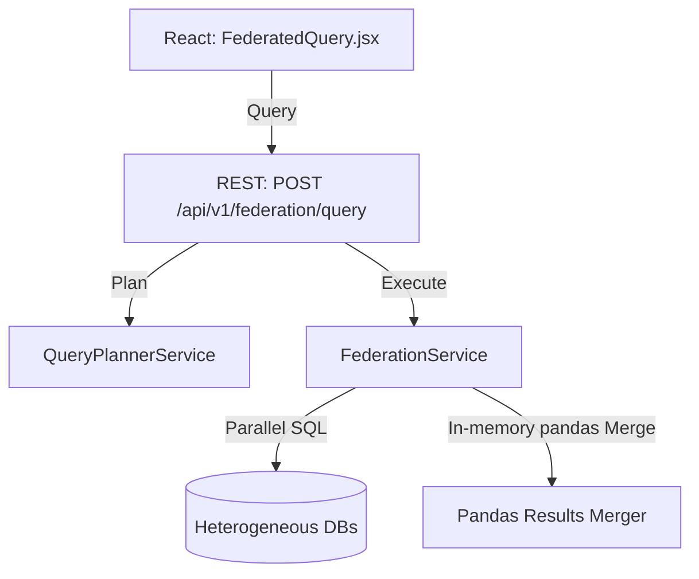

# Enterprise Federated Multi-Database Query Engine

The platform features an offline Federated Query Engine enabling cross-database query executions across heterogeneous database engines (PostgreSQL, MySQL, SQLite) using unified natural language prompts.

## Architecture

## Federation Strategy
1. **Unified Schema Catalog compilation**: Builds virtual unified catalog combining cached schemas, semantic synonyms, and knowledge graph references.
2. **LLM Query Planning**: The query planner structures JSON execution plans specifying target databases, isolated SQL subqueries, and join/union actions.
3. **Parallel Execution**: Subqueries are run in parallel threads using connection pool engines.
4. **In-Memory Merging**: Pandas handles joins (INNER/LEFT) and stacks (UNION/UNION ALL) in-memory before returning records to the client.

## Failure Handling & Resiliency
- **Partial Failure Mode**: If one database connection fails (network timeout, authentication failure), the engine continues executing subqueries on online databases, returns partial datasets, and maps errors into execution warning arrays.
- **Log Records**: Stores execution history log templates in `federated_queries` database table.
