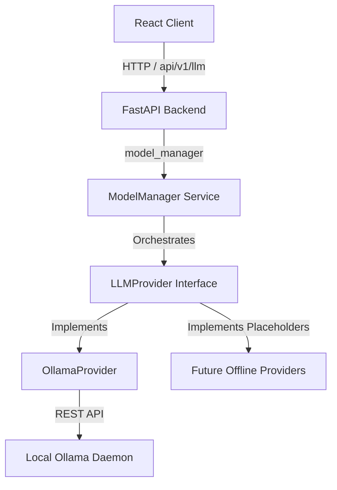

# Local Offline LLM Integration Framework

The Local LLM Framework provides a provider-agnostic interface to orchestrate multiple offline language models running locally via **Ollama**, with placeholders for future offline providers (**llama.cpp**, **vLLM**, **LM Studio**, **Hugging Face Local**).

---

## Architecture Diagram



---

## 🛠️ Ollama Installation & Setup

1. **Install Ollama**:
   Download and install Ollama for your operating system from the official page: [ollama.com](https://ollama.com).

2. **Start the Ollama daemon**:
   Verify Ollama is running locally:
   ```bash
   ollama --version
   ```
   By default, it will be running on `http://localhost:11434`.

3. **Download Language Models**:
   Pull your preferred offline language model(s):
   ```bash
   ollama pull llama3
   ollama pull qwen
   ollama pull mistral
   ollama pull phi
   ```

---

## ⚙️ Configuration (.env)

Configure variables in your `.env` file to activate local LLM orchestrations:

```env
# Active provider: 'ollama', 'llama.cpp', 'vllm', 'lm_studio', or 'huggingface_local'
LLM_PROVIDER=ollama

# Ollama Endpoint
OLLAMA_URL=http://localhost:11434

# Active default model
LLM_DEFAULT_MODEL=llama3

# Connection and Read Timeout in seconds
OLLAMA_TIMEOUT=30

# Enable streaming globally
LLM_STREAMING=false
```

---

## 💻 API Endpoints

All endpoints require standard user authentication.

| Method | Endpoint | Description | Role Required |
|---|---|---|---|
| **GET** | `/api/v1/llm/models` | Lists active and installed models on the provider | Viewer |
| **GET** | `/api/v1/llm/status` | Exposes connection health and latency metrics | Viewer |
| **POST** | `/api/v1/llm/select` | Switches the active model dynamically | Data Analyst, Scientist, Admin |
| **POST** | `/api/v1/llm/test` | Test prompts. Supports SSE streaming payloads | Viewer |

---

## 🔧 Troubleshooting

### 1. Ollama Connection Offline
* **Symptom**: System Health displays the Local LLM card as `unhealthy`, or `ollama_connected: false` in `/status`.
* **Fix**: Verify that the Ollama process is running. Run `curl http://localhost:11434` to ensure it responds. If running on a different port/IP, adjust `OLLAMA_URL` in `.env`.

### 2. Model Unavailable / Not Found
* **Symptom**: Switch request fails or queries return missing model errors.
* **Fix**: Verify you pulled the model name exactly. Check locally installed models with:
  ```bash
  ollama list
  ```
  Ensure the model name aligns with your choice (e.g. `llama3` or `llama3:latest`).

### 3. Latency issues
* **Symptom**: Large SQL queries or insight generations take more than 10 seconds.
* **Fix**: Ensure your local hardware (GPU/RAM) matches the resource requirements of the selected model size. Switching to a smaller quantized model (like `phi` or `qwen`) can drastically reduce latency.
