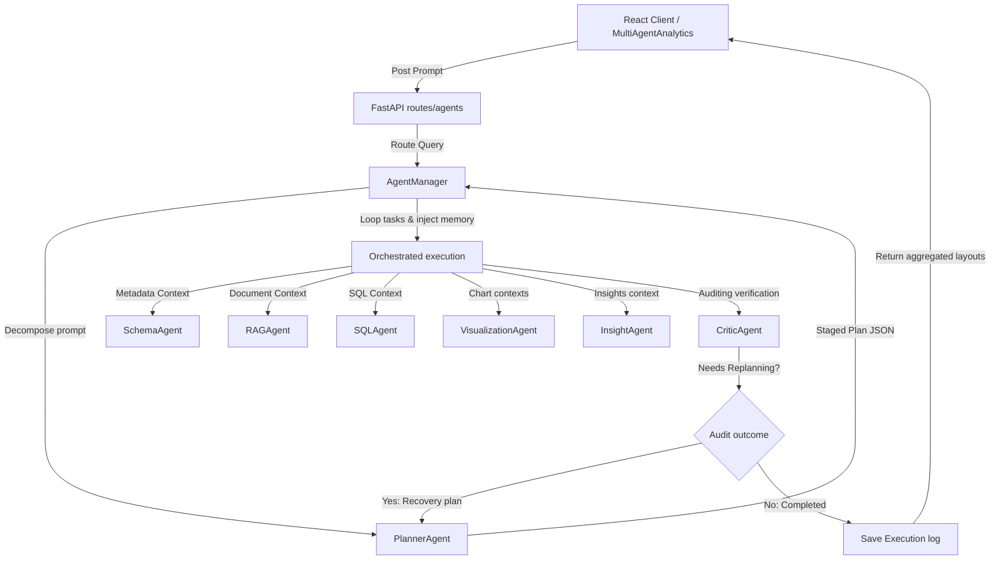

# Enterprise Multi-Agent Analytics System Documentation

This document describes the orchestration patterns, agent definitions, memory sharing model, critic auditing recovery steps, and guidelines to extend new agents.

---

## 📐 Multi-Agent Architecture

The orchestration uses a centralized coordinator (**Agent Manager**) to manage sequential data execution:



---

## 🔀 Orchestration & Routing Logic

1. **Planner Agent**: Interprets the user question, identifies target databases/parameters, and compiles a structured list of tasks indicating which agent should run and what its instructions are.
2. **Sequential Dispatcher**: The Agent Manager executes the task list in sequence. The output of each agent is saved in a unified **Shared Memory** namespace.
3. **Memory Injection**: When invoking an agent, the Agent Manager injects the Shared Memory context, allowing downstream agents (e.g. SQLAgent, VisualizationAgent) to read parameters generated upstream (e.g. schema context, table names).

---

## 🛡️ Critic Auditing & Recovery Loops

The **Critic Agent** performs quality checks before releasing the final answer:
- Checks SQL query translations for accuracy.
- Checks insights against raw query results to prevent hallucinated observations.
- Calculates final confidence scores.
- **Plan Recovery Step**: If the Critic detects discrepancies or flags `needs_replanning = true`, the Agent Manager starts a recovery loop. It feeds Critic critiques back into the Planner Agent to compile a refined plan. Recovery attempts are capped at **2 iterations** to avoid loop hang-ups.

---

## 🧠 Memory Model

Each execution maintains:
- **Shared Memory**: In-memory dictionary containing full JSON structures generated by each agent.
- **Timeline Logs**: Details steps completed, statuses, and agent execution durations.
- **Auditing Logs**: Details critic scores and re-planning notes.
- Logs are persisted in the SQLite DB in `agent_executions` for replay triggers.

---

## 🔌 Extending New Agents

To register a new agent:
1. **Define the Agent class**: Create a file `backend/app/services/my_new_agent.py` implementing `execute_task(..., shared_memory)`.
2. **Register in Agent Manager**:
   - Import your agent inside `backend/app/services/agent_manager.py`.
   - Add your agent instance inside `__init__`.
   - Add a dispatch handler inside the `run_analytics_query` loop:
     ```python
     elif agent_name == "MyNewAgent":
         agent_output = await self.my_new_agent.execute_task(shared_memory)
     ```
3. **Register in Planner System Prompts**: Update the planner instructions in `planner_agent.py` to allow the Planner Agent to delegate tasks to `MyNewAgent`.
