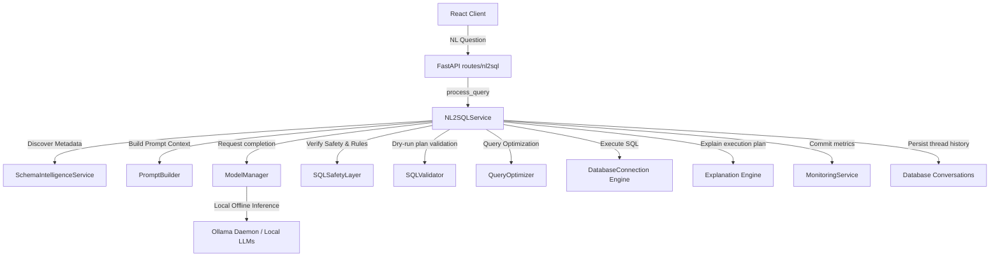

# Enterprise Natural Language to SQL (NL2SQL) Engine Documentation

This guide describes the architecture, query pipelines, prompt building strategies, SQL safety constraints, and query validations that power the platform's local offline NL2SQL query engine.

---

## 🏛️ Architecture & Query Pipeline

The NL2SQL engine is built with a decoupled clean architecture:

### Pipelines Flow:
1. **Dynamic Schema Discovery**: Query the destination connection properties (tables, columns, primary/foreign keys).
2. **Context Compilation**: Inject tables, relationships, and dialects into contextual prompt structures.
3. **LLM Query Generation**: Run local LLM inference via ModelManager.
4. **Safety Verification**: Ensure the generated query passes strict security regex expressions.
5. **Execution Plan Validation**: Check database schema correctness via dry-run `EXPLAIN`.
6. **Query Optimization**: Recommend index updates and performance cost reductions.
7. **Thread Recording**: Save message history and execution latency records.

---

## 🧠 Prompt Strategy

All templates are located in `prompt_builder.py`. Prompt structure is strictly database-aware and dialect-aware. Prompts are constructed using:
- **Discovered Database Schema**: Precise table names and column spec maps.
- **Table Relationships**: Discovered foreign keys.
- **Business Rules & Limits**: Query safety instructions.
- **Conversation Thread Logs**: Multi-turn history.

### Output JSON Format:
To prevent unstructured text outputs from local LLMs, prompts strictly instruct the LLM to output a JSON object containing:
- `sql`: The raw compiled database query.
- `confidence_score`: Score estimating query precision.
- `explanation`: Contextual description of database transformations.

---

## 🛡️ SQL Safety Layer & Rules

The `SQLSafetyLayer` class enforces strict read-only execution constraints:
1. **Forbidden Operations**: Blocks queries containing `DROP`, `DELETE`, `TRUNCATE`, `ALTER`, `UPDATE`, `INSERT`, `CREATE`, `EXEC`, `EXECUTE`, `GRANT`, `REVOKE`.
2. **Select Guard**: Checks that statements start with `SELECT` or common table expressions (`WITH`).
3. **Catalog Protection**: Rejects access to system schemas (such as `pg_catalog`, `information_schema`, `sqlite_master`, `sys`).
4. **Inefficient Join Restrictions**: Prohibits expensive Cartesian products (`CROSS JOIN`).
5. **Injection Mitigation**: Strips comments, checks for tautologies (e.g. `OR 1=1`), union-based attacks, and blocks semicolon multi-statement execution.

---

## 🔌 Supported Databases

- **PostgreSQL**: Implements connection pools via pg_isready/psycopg2. Cost and plan validation parsed from standard `EXPLAIN`.
- **MySQL**: Connection pool managed via PyMySQL drivers.
- **SQLite**: Local SQLite files. Validation performed via `EXPLAIN QUERY PLAN` plan scans.

---

## ⚠️ Known Limitations

1. **Quantized Local Model Accuracy**: Quantized local LLMs (like `llama3` or `mistral`) may occasionally generate incorrect field names on complex schema setups. Use database column descriptions to increase accuracy.
2. **Dynamic Dialect Syntax Errors**: Complex subqueries or date manipulations might occasionally raise syntax warnings. In these cases, the service triggers optimization and recovery mechanisms.
3. **Cartesian Join False Positives**: Complex query layouts with implicit comma-joins might occasionally be flagged. Using explicit standard `JOIN` syntax resolves this constraint.
