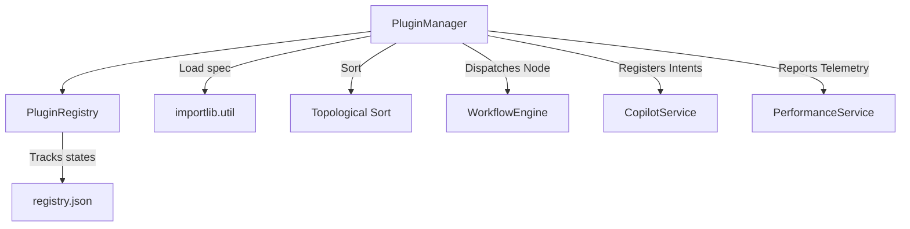

# Enterprise Plugin Extension SDK Architectural Specifications

This document outlines the software design, folder organization, and core service layers powering the 100% offline Enterprise Plugin Extension SDK.

## Core Component Diagram


## Directory Structure
Active plugins are stored in isolation under the `installed` directory, while template blueprints are kept in the `marketplace` catalog folder.
```
backend/app/plugins_store/
├── registry.json
├── installed/
│   ├── __init__.py
│   ├── csv_import_plus/
│   │   ├── metadata.json
│   │   └── main.py
│   └── custom_report/
│       ├── metadata.json
│       └── main.py
└── marketplace/
    ├── __init__.py
    ├── csv_import_plus/
    │   ├── metadata.json
    │   └── main.py
    └── ...
```

## Class Capability Interfaces
All plugins inherit from the abstract base class [BasePlugin](file:///c:/Users/DELL/OneDrive/ai-data-analyst/backend/app/services/plugin_sdk.py#L9-L38):

1. **DataSourcePlugin**: Enables custom file parsing or API integrations.
2. **WorkflowNodePlugin**: Exposes custom node logic inside the visual canvas DAG builder.
3. **AIToolPlugin**: Provides tool definitions and execution functions to the AI Copilot.
4. **ReportPlugin**: Generates document reports in PDF, Word, or PowerPoint format.
5. **VisualizationPlugin**: Computes configurations for rendering custom UI visualizations.
6. **AnalyticsPlugin**: Computes predictive calculations, statistical indexes, or business rules.

## Core Services

### 1. Dynamic Loader & Reflection Filter
The dynamic loading module uses `importlib` utility specs. To prevent namespace collision and abstract class instantiations, the reflection loop filters classes matching the target package name:
```python
if isinstance(attr, type) and issubclass(attr, BasePlugin) and attr is not BasePlugin:
    if attr.__module__ == module_name:
        return attr()
```

### 2. Topological Dependency Sorter
A DFS-based sorting algorithm orders plugin dynamic loading. Circular dependencies or missing package associations raise loading errors cleanly:
```python
def dep_check(pid: str):
    visited[pid] = 0
    deps = candidates[pid]["metadata"].get("dependencies", [])
    for dep in deps:
        if dep not in visited:
            dep_check(dep)
        elif visited[dep] == 0:
            raise ValueError(f"Circular dependency detected")
    visited[pid] = 1
    resolved.append(pid)
```

### 3. Isolated Execution Boundaries
Execution runs are wrapped inside strict async timeouts (default: 60s) to prevent runaway processes from blocking backend workers. Telemetry metrics track total loads, usages, duration latency, and failures, sending them to Prometheus counters and histograms.
