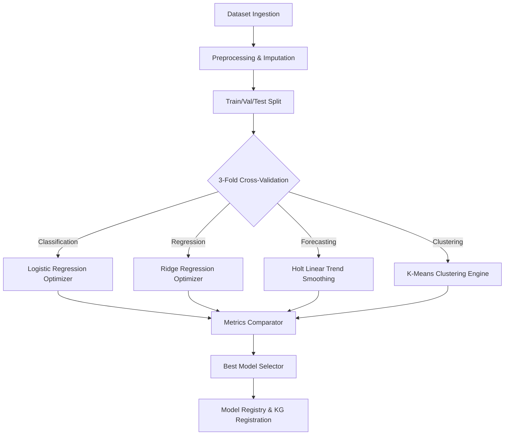

# Enterprise Predictive Analytics Platform

This document describes the design, AutoML pipeline structures, and implementation specifications for the Predictive Analytics extension.

## 🧠 AutoML Architecture

The predictive analytics module provides fully offline Automated Machine Learning (AutoML) capabilities. It runs 100% locally using lightweight NumPy/Pandas model implementations:

---

## 1. Preprocessing & Feature Selection

- **Null Imputation**: Computes mean for continuous numerical values and mode for categorical strings.
- **Label Encoding**: Dynamically maps string categories to continuous integer targets for low-cardinality columns.
- **Normalization (Z-Score)**: Standardizes features by subtracting mean and dividing by standard deviation to align weights sensitivity:
  $$X_{scaled} = \frac{X - \mu}{\sigma}$$

---

## 2. Model Selection & Hyperparameter Search

1. **Cross-Validation**: Implements a deterministic 3-Fold split on tabular entries to evaluate out-of-fold metrics stability.
2. **Grid Search Parameters**:
   - *Logistic Regression*: Searches learning rate (`[0.01, 0.1]`) and L2 penalty coefficients (`[0.0, 0.1]`).
   - *Ridge Regression*: Searches regularization multipliers (`[0.0, 1.0, 10.0]`).
   - *Forecasting*: Searches level smoothing factors $\alpha$ and trend factors $\beta$.
   - *Clustering*: Searches cluster sizes $K \in \{2, 3, 5\}$.
3. **Registry Serialization**: Trained parameters, features maps, and scaling weights are saved as JSON payloads directly inside the `RegisteredModel` table, removing external file pickle dependencies.

---

## 3. Integration Flow

- **Knowledge Graph**: Successful training triggers incremental registration. Creates a `Model` entity, links it to its training `Dataset` (`trained_on`), target column (`predicts_target`), and feature columns (`uses_feature`).
- **Workflows Builder**: Executes custom DAG pipeline runs via the native `model_training` and `prediction` task nodes.
- **Copilot router**: Detects target phrases (e.g. *"predict sales"*) to trigger AutoML trainings and inference pipelines.

---

## 4. Current Limitations

- **Linearity Assumptions**: Logistic and Ridge algorithms assume linear dependencies.
- **Time Series Scale**: Forecasting smoothing assumes consistent seasonal frequencies.
