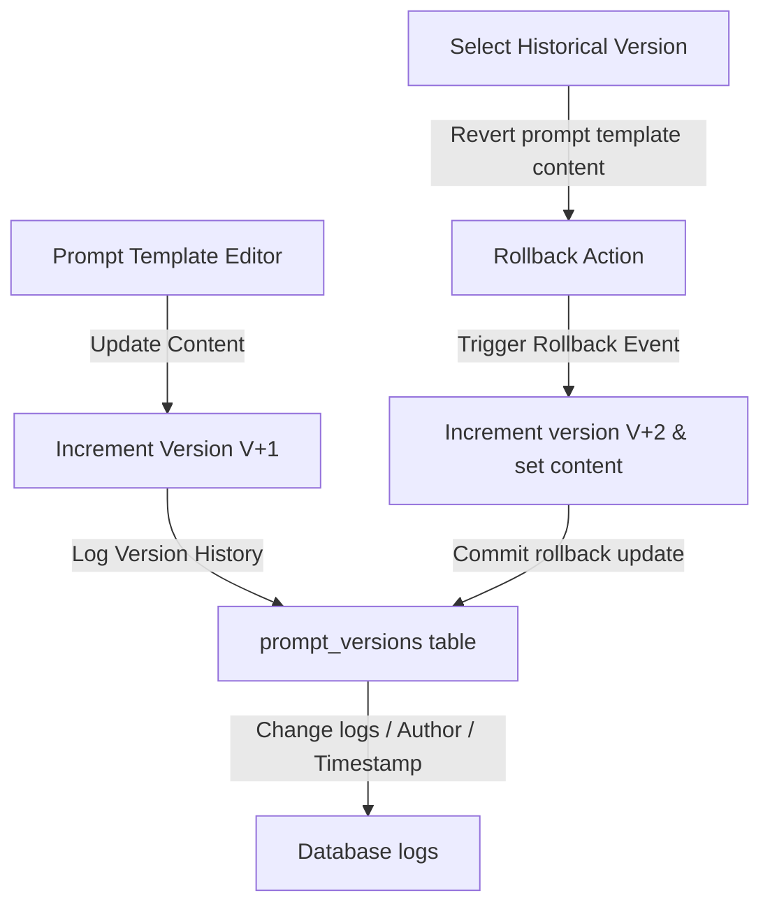

# Enterprise Prompt Management Documentation

This document describes the offline prompt template management patterns, versioning lifecycle, rollback procedures, and placeholder verification guidelines.

---

## 📐 Prompt Templates & Placeholders

The Prompt Template system supports parameter interpolation using `{variable_name}` formats:
- **Automatic Variables Detection**: When saving templates, the system extracts placeholder lists using regex.
- **Validation**: Placeholders are matched against expected system states before execution triggers.

---

## 📜 Versioning & Rollback Workflow

1. **Incremental Updates**: Updates do not override history; they register new version lines containing author notes and timestamps.
2. **Deterministic Rollback**: Reverting a template creates a new active version matching the historical text.
