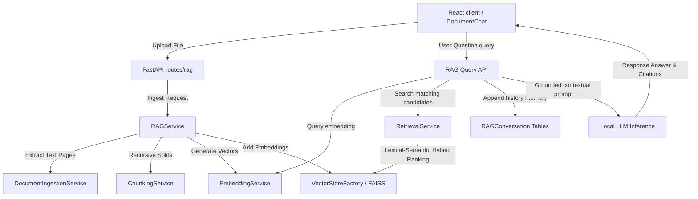

# Enterprise Retrieval-Augmented Generation (RAG) System Documentation

This document describes the design architecture, text splitting configurations, semantic-lexical search details, conversation memory management, and deployment properties of the RAG system.

---

## 📐 RAG Engine System Architecture

The Offline RAG system uses a modular clean architecture:

---

## 📏 Text Chunking Strategy

Documents are broken down into isolated vectors using a **Recursive Character Splitting** approach:
- **Separators**: Evaluates layout boundaries recursively using `["\n\n", "\n", " ", ""]`.
- **Target Size**: 800 characters per chunk.
- **Overlap**: 150 characters, ensuring semantic boundaries are preserved across splits.
- **Payload Preservation**: Retains document UUID reference, filename, local page numbers, and filesystem path pointers for trace citation outputs.

---

## 🧠 Sentence Embeddings & Vector Indexing

- **SentenceTransformers**: Defaulting to the local pre-trained model `all-MiniLM-L6-v2` producing dense 384-dimension embeddings.
- **FAISS & ChromaDB**: Managed through a factory abstraction (`VectorStoreFactory`) supporting indexes.
- **Zero-Failure Hybrid Cosine Fallback**: If target hardware lacks C++ compilation packages, a pure Python NumPy Cosine similarity matcher automatically runs to ensure 100% operation safety.

---

## 🔀 Hybrid Dense-Lexical Ranking

To ground LLM answers with precision, search results combine:
1. **Semantic Score**: Dense vector Cosine similarity measuring matching semantic meanings.
2. **Lexical Score**: BM25/TF-IDF token match overlaps measuring exact keyword occurrences.
3. **Weight (Alpha)**: Defaults to $0.7 \times \text{Semantic} + 0.3 \times \text{Lexical}$.
4. **Duplicate Removal**: Eliminates chunks with identical content.

---

## 📚 Data Dictionary & Schema Support

RAG queries automatically include business context:
- Document uploads marked as type `data_dictionary` (business glossary, database schemas, column definitions) are indexed.
- The retrieval layer implicitly queries data dictionary indices for every user prompt, prepending dictionary context to the prompt templates.

---

## ⚠️ Known Limitations

1. **Local LLM Context Limits**: Context window fits general chunks (Top 4) and glossary items (Top 3). Larger history threads are truncated.
2. **First-Load Latency**: Ingesting the first document initiates loading SentenceTransformers models, causing a slight initial delay. Subsequent requests run instantly.
3. **OCR Processing**: Ingestion extracts text only. Scanned image PDFs are ignored.
