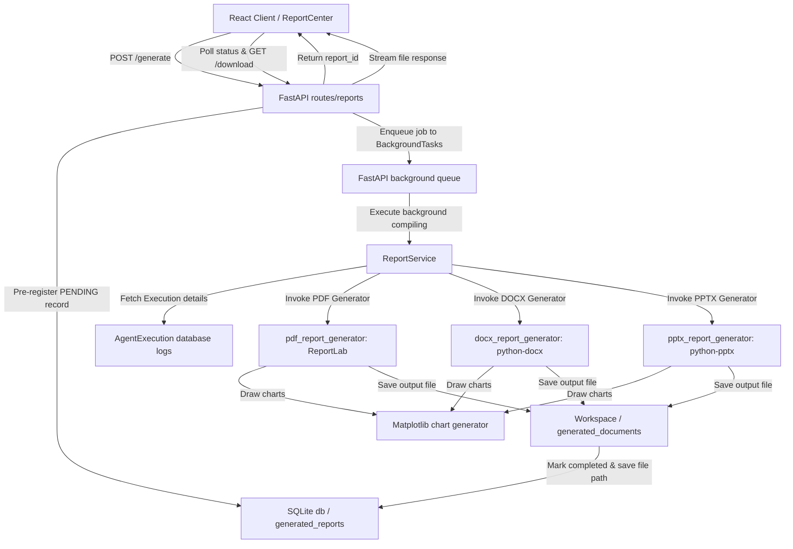

# Enterprise AI Report Generation System Documentation

This document describes the report compilation architecture, supported formats, background workers workflow, branding parameters, and system boundaries.

---

## 📐 Architecture & Workflow

The Report Generation system compiles PDF, DOCX, and PPTX reports completely offline without querying cloud generation services:

---

## 📋 Reusable Report Templates

The system supports 5 standard templates configured through JSON configurations:

1. **Executive Report**: High-level visual document emphasizing cover headers, KPI summaries, chart trends, and plain-English recommendations.
2. **Technical Report**: Audit documents focusing on columns listings, schema context layouts, executed SQL, and execution times.
3. **Audit Report**: Compliance layout detailing Critic scores, timeline steps logs, and RAG cited sources.
4. **Data Quality Report**: Standard transforms summaries outlining imputed null percentages and outliers indexes (using AI Cleaning registries).
5. **AI Insights Report**: Highlight document grouping business opportunities, risk parameters, and trends.

---

## 🎨 Corporate Branding & Customization

The document layouts support branding configuration inputs:
- **Company Name**: Printed inside headers, slides descriptions, and tables columns.
- **Report Version**: Tracks changes.
- **Generation Timestamps**: Outputs UTC markers on every cover sheet.

---

## 💾 File Formats & Libraries

All compiling libraries run completely offline:
- **PDF**: Uses **ReportLab** to build document templates and custom table styles.
- **DOCX**: Uses **python-docx** to build paragraphs, page structures, lists, and tables.
- **PPTX**: Uses **python-pptx** to assemble slide sequences (Title, KPI bullet lines, chart slides).
- **Charts**: Draws PNG visual plots dynamically using **Matplotlib** and embeds them directly.

---

## ⚠️ Known Limitations

1. **Matplotlib Layouts**: Charts are exported as static PNGs. Interactive elements are not supported within the compiled PDFs.
2. **Page Flow limits**: Extremely long SQL code blocks might wrap or overflow PDF table grids.
