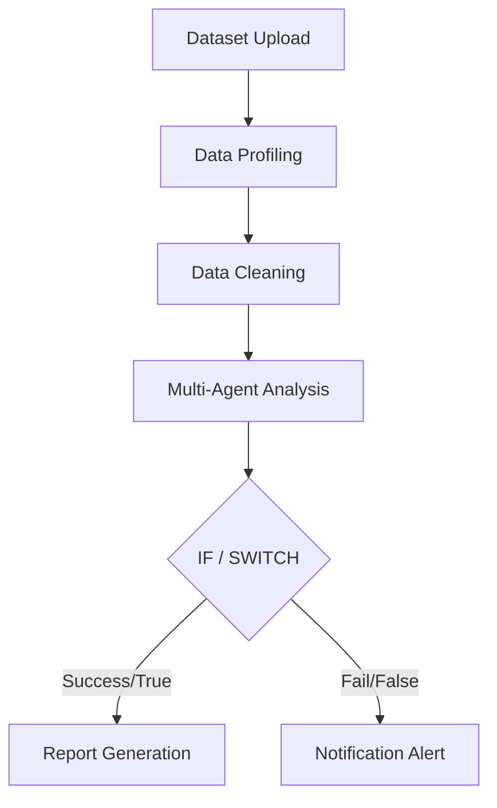

# Offline Enterprise Workflow Automation Engine

This document provides details on the backend workflow engine, execution state, retry/timeout policies, database schemas, and scheduler cycles.

## Architecture & Topology

The workflow engine executes complex analytical pipelines modeled as Directed Acyclic Graphs (DAGs). Workflows are defined via a JSON structure containing:
- **Nodes**: Logical operations configured with inputs, outputs, validation schemas, retry policies, and timeouts.
- **Edges**: Connectivity mapping defining control flow directions.

## Node Execution Handler

Each node type leverages the corresponding enterprise service:
1. **Dataset Upload**: Validates flat file records.
2. **Data Profiling**: Generates anomaly warnings and Outliers grids using `ProfilingService`.
3. **Data Cleaning**: Runs whitespace normalizations and mixed types mapping using `CleaningService`.
4. **SQL Query**: Executes safe queries on PostgreSQL, SQLite, or local database connections.
5. **RAG Query**: Semantic glossary context grounding lookup using `RAGService`.
6. **Multi-Agent Analysis**: Orchestrates planning loops and Critic score evaluations.
7. **Explainability**: Returns XAI audit lists using `XAIService`.
8. **Report Generation**: Sync compiles PDF, Word, or PowerPoint presentation files.
9. **Notification**: Dispatches real-time alerts.
10. **Export**: Copies and compiles files for download.

### Retry & Timeout Policies

- **Retries**: Configurable `max_retries` and `delay`. If a node fails, the engine retries the execution before marking it failed.
- **Timeouts**: Wraps execution blocks in an `asyncio.timeout` wrapper. If execution exceeds the threshold, the node is aborted.

## Control Flow Logic

- **IF**: Evaluates comparisons (e.g. `==`, `<`, `>`, `contains`) against output variables.
- **SWITCH**: Dispatches execution downstream based on value matching.
- **Loops**: Repeats sub-DAGs for iterative processing.
- **Failure Branches**: If a node fails and a failure branch is connected, the engine redirects execution downstream instead of failing the workflow.

## Recurring Scheduler Daemon

A background scheduler runs in a dedicated daemon thread inside the lifespan context of `main.py`:
- Periodically scans for active schedules.
- Resolves scheduled cron expressions (using 5-field interval evaluation) or interval timers (Daily, Weekly, Monthly).
- Queues workflow tasks for execution.
